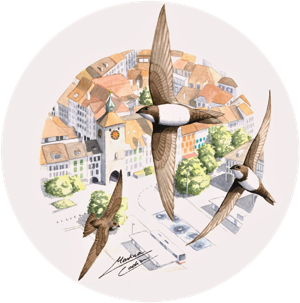

&nbsp;

</a>

## Effects of climate change on Alpine swift morphology and phenology

&nbsp;

* __<a href="https://scholar.google.com/citations?hl=it&user=AQOliiAAAAAJ" target="_blank" rel="noopener noreferrer">Dr. Pierre Bize</a>__, Swiss Ornithological Institute, Switzerland

* __<a href="https://scholar.google.com/citations?user=w6axPGHSSWsC&hl=it&oi=ao" target="_blank" rel="noopener noreferrer">Prof. Julien Martin</a>__, University of Ottawa, Canada. <a href="https://juliengamartin.github.io/" target="_blank" rel="noopener noreferrer">Research group website</a>.

* __<a href="https://www.researchgate.net/profile/Michela-Dumas" target="_blank" rel="noopener noreferrer"> Dr. Michela Dumas</a>__, University of Ottawa, Canada

&nbsp;

See the project [here]().

&nbsp;

&nbsp;

## Heat stress during growth

* __<a href="https://scholar.google.com/citations?hl=it&user=AQOliiAAAAAJ" target="_blank" rel="noopener noreferrer">Dr. Pierre Bize</a>__, Swiss Ornithological Institute, Switzerland

* __<a href="https://scholar.google.com/citations?user=9oof6dwAAAAJ&hl=it&oi=ao" target="_blank" rel="noopener noreferrer">Dr. Chiara Morosinotto</a>__, University of Padova, Italy

* __<a href="https://scholar.google.com/citations?user=C1HtKa4AAAAJ&hl=en" target="_blank" rel="noopener noreferrer">Dr. Antoine Stier</a>__, IPHC, Strasbourg

* __<a href="https://www.vogelwarte.ch/en/team/cloe-hadjadji/" target="_blank" rel="noopener noreferrer">Cloé Hadjadji</a>__, Swiss Ornithological Institute, Switzerland

## Repeatability and heritability of migratory traits

* __<a href="https://scholar.google.com/citations?hl=it&user=AQOliiAAAAAJ" target="_blank" rel="noopener noreferrer">Dr. Pierre Bize</a>__, Swiss Ornithological Institute, Switzerland

* __Dr. Christoph Meier__

## Amazing artwork

&nbsp;

* __<a href="https://martinacadin.blogspot.com/" target="_blank" rel="noopener noreferrer">Martina Cadin</a>__, University of Turin, Italy.
